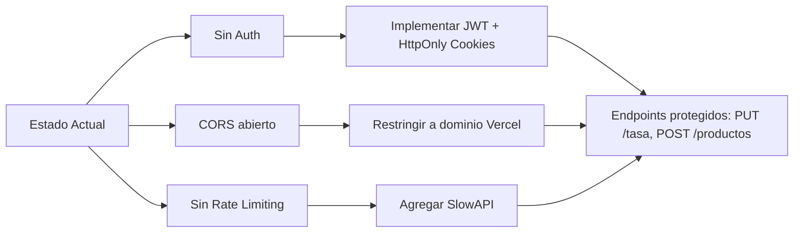

# 🔍 Análisis Comparativo: Proyecto Existente vs. Especificación PWA

## Resumen Ejecutivo

> [!IMPORTANT]
> **Recomendación: Limpiar y adaptar el proyecto existente.** El 70-80% de la infraestructura ya está construida y funcional. Crear desde cero desperdiciaría semanas de trabajo ya invertido.

---

## 1. Matriz de Cobertura — ¿Qué ya existe vs. qué falta?

| Requisito (Especificación)              | Estado Actual            | Esfuerzo para Adaptar |
|-----------------------------------------|--------------------------|----------------------|
| **Stack: Next.js + TypeScript + Tailwind** | ✅ Existe (Next.js 16, TS, Tailwind v4) | Ninguno |
| **Stack: FastAPI (Python)**             | ✅ Existe (FastAPI + SQLModel + asyncpg) | Ninguno |
| **Stack: PostgreSQL**                   | ✅ Existe (Docker local + Alembic) | Mínimo (cambiar a Neon.tech/Supabase) |
| **Stack: TanStack Query**              | ✅ Existe (v5 configurado) | Ninguno |
| **PWA (instalable en móvil)**          | ❌ No existe | Medio (~2-3h) |
| **Cloudflare DNS/WAF**                 | ❌ No existe (config de deploy) | Bajo (config externa) |
| **Rate Limiting (SlowAPI)**            | ❌ No existe | Bajo (~1h) |
| **Auth JWT en cookies HttpOnly**       | ❌ No existe | Medio (~3-4h) |
| **CORS estricto**                      | ⚠️ Existe pero permisivo (`https?://.*`) | Bajo (~15min) |
| **Modelo: `tasa_cambio`**              | ✅ Existe como `exchange_rates` (más completo) | Ninguno |
| **Modelo: `productos`**               | ✅ Existe como `products` (más completo) | Ninguno |
| **`GET /productos?q={search}`**        | ✅ Existe (`GET /api/v1/products?search=`) | Ninguno |
| **`PUT /tasa`**                        | ✅ Existe (`PUT /api/v1/rate/current`) | Ninguno |
| **`POST /productos`**                  | ✅ Existe (`POST /api/v1/products`) | Ninguno |
| **Validación Pydantic estricta**       | ⚠️ Parcial (falta `gt=0` en precios) | Bajo (~30min) |
| **Despliegue Vercel (Frontend)**       | ✅ Previsto (config lista) | Ninguno |
| **Despliegue Render/Koyeb (Backend)**  | ⚠️ Configurado para Railway | Bajo (cambiar target) |
| **Costo $0**                           | ⚠️ Docker local para DB (no serverless) | Bajo (migrar a Neon.tech) |

---

## 2. Lo que el Proyecto Actual TIENE DE MÁS (Complejidad Extra)

El proyecto existente tiene funcionalidades que **no están en la especificación** y que añaden complejidad innecesaria si el objetivo es un catálogo minimalista:

| Funcionalidad Extra          | Archivos Involucrados | ¿Qué hacer? |
|------------------------------|----------------------|-------------|
| Tabla `categories` + CRUD   | `models/category.py`, `schemas/category.py`, `repositories/`, `services/`, `api/categories.py` | **Evaluar**: útil para filtrar, pero la spec no lo menciona |
| Tabla `brands` + CRUD       | `models/brand.py`, `schemas/brand.py`, `repositories/`, `services/`, `api/brands.py` | **Evaluar**: la spec no lo contempla |
| DolarAPI auto-fetch          | `services/dolar_service.py` | **Mantener**: valioso para tasa automática |
| Rate history + paginación    | `api/rates.py`, historial completo | **Mantener**: audit trail útil |
| Framer Motion animations     | Múltiples componentes | **Mantener**: mejora UX |
| Dashboard multi-vista        | `app/dashboard/`, `app/tasas/`, sidebar | **Evaluar**: la spec habla de catálogo minimalista |
| Agente IA (Fase 3 planificada) | No implementado aún | **Descartar**: fuera de scope |

---

## 3. Lo que FALTA Implementar (Gap Analysis)

### 🔴 Crítico — Seguridad



| Gap | Descripción | Esfuerzo |
|-----|-------------|----------|
| **JWT Auth** | No hay sistema de autenticación. Se necesita: modelo `User`, hashing con `bcrypt`, login endpoint, middleware de verificación JWT, cookies `HttpOnly`+`Secure` | **3-4 horas** |
| **Rate Limiting** | Instalar `slowapi`, configurar `Limiter` en `main.py`, decorar endpoints públicos (~60 req/min por IP) | **1 hora** |
| **CORS Estricto** | Cambiar `allow_origin_regex=r"https?://.*"` por dominio específico de Vercel | **15 minutos** |
| **Validación estricta** | Agregar `gt=0` a `price_usd` en schemas, validar que `nombre` no sea vacío/solo espacios | **30 minutos** |

### 🟡 Medio — PWA

| Gap | Descripción | Esfuerzo |
|-----|-------------|----------|
| **Manifest** | Crear `manifest.json` con `name`, `short_name`, `icons`, `start_url`, `display: standalone`, `theme_color` | **30 min** |
| **Service Worker** | Configurar `next-pwa` o `@serwist/next` para cache offline | **1-2 horas** |
| **Meta tags** | Agregar `<meta name="theme-color">`, `<link rel="manifest">`, `apple-touch-icon` | **15 min** |
| **Icons** | Generar iconos en múltiples resoluciones (192x192, 512x512) | **30 min** |

### 🟢 Bajo — Infraestructura de Deploy

| Gap | Descripción | Esfuerzo |
|-----|-------------|----------|
| **Neon.tech/Supabase** | Crear instancia PostgreSQL serverless gratuita, actualizar `DATABASE_URL` | **30 min** |
| **Render/Koyeb** | Crear `Dockerfile` para backend, configurar deploy | **1-2 horas** |
| **Cloudflare** | Configurar DNS proxy, WAF rules, Bot Fight Mode | **1 hora** (config externa) |

---

## 4. Comparación de Modelos de Datos

### Especificación Solicitada vs. Existente

````carousel
### 📋 Modelo de la Especificación (Mínimo)
```sql
-- Tabla: tasa_cambio
CREATE TABLE tasa_cambio (
    id SERIAL PRIMARY KEY,
    monto DECIMAL(10, 2) NOT NULL,
    fecha_actualizacion TIMESTAMP WITH TIME ZONE DEFAULT CURRENT_TIMESTAMP
);

-- Tabla: productos
CREATE TABLE productos (
    id SERIAL PRIMARY KEY,
    nombre VARCHAR(120) NOT NULL, -- indexado
    precio_usd DECIMAL(10, 2) NOT NULL,
    activo BOOLEAN DEFAULT TRUE
);
```
<!-- slide -->
### 🏗️ Modelo Existente (Más Completo)
```sql
-- exchange_rates (superset de tasa_cambio)
CREATE TABLE exchange_rates (
    id SERIAL PRIMARY KEY,
    rate NUMERIC(15, 5) NOT NULL,         -- ✅ más precisión
    source VARCHAR NOT NULL,              -- ➕ extra: origen del dato
    rate_date DATE NOT NULL,              -- ➕ extra: fecha del valor
    fetched_at TIMESTAMP NOT NULL         -- ≈ fecha_actualizacion
);

-- products (superset de productos)
CREATE TABLE products (
    id SERIAL PRIMARY KEY,
    name VARCHAR NOT NULL,                -- ≈ nombre (indexado ✅)
    price_usd NUMERIC(10, 2) NOT NULL,    -- ≈ precio_usd
    category VARCHAR NOT NULL,            -- ➕ extra
    category_id INT REFERENCES categories(id),  -- ➕ extra
    brand VARCHAR,                        -- ➕ extra
    brand_id INT REFERENCES brands(id),   -- ➕ extra
    unit VARCHAR NOT NULL,                -- ➕ extra
    weight_kg FLOAT,                      -- ➕ extra
    is_active BOOLEAN DEFAULT TRUE,       -- ≈ activo
    created_at TIMESTAMP NOT NULL,        -- ➕ extra
    updated_at TIMESTAMP NOT NULL         -- ➕ extra
);
```
````

> [!NOTE]
> El modelo existente es un **superset** del modelo de la especificación. No hace falta eliminar columnas — los campos extra (`category`, `brand`, `unit`, `weight_kg`) aportan valor sin costo adicional.

---

## 5. Comparación de Endpoints

| Endpoint (Spec)                    | Equivalente Existente                | Estado |
|------------------------------------|--------------------------------------|--------|
| `GET /productos?q={search}`        | `GET /api/v1/products?search={q}`    | ✅ Funcional + paginación + sort |
| `PUT /tasa`                        | `PUT /api/v1/rate/current`           | ✅ Funcional |
| `POST /productos`                  | `POST /api/v1/products`              | ✅ Funcional |
| *(no en spec)* `GET /productos/{id}` | `GET /api/v1/products/{id}`        | ✅ Extra útil |
| *(no en spec)* `PUT /productos/{id}` | `PUT /api/v1/products/{id}`        | ✅ Extra útil |
| *(no en spec)* `DELETE /productos/{id}` | `DELETE /api/v1/products/{id}`  | ✅ Extra útil (soft delete) |
| *(no en spec)* Auto-fetch tasa BCV | `POST /api/v1/rate/update-rate`      | ✅ Bonus valioso |
| *(no en spec)* Historial de tasas  | `GET /api/v1/rate/history`           | ✅ Audit trail |

---

## 6. Veredicto Final

### ❌ Crear desde cero NO es recomendable porque:
1. **El backend ya tiene** la arquitectura Clean (repos → services → API), Alembic, asyncpg, modelos maduros
2. **El frontend ya tiene** TanStack Query integrado, diseño profesional con Tailwind v4, componentes CRUD completos, sistema de diseño
3. **Los endpoints de la spec ya existen** y funcionan con más features (paginación, sort, filtros)
4. **El modelo de datos existente es un superset** — no hay conflicto, solo valor adicional
5. Perderías: tests existentes, migraciones, configuraciones de linting, diseño UI pulido

### ✅ Adaptar el proyecto existente requiere solo:

| Tarea                                    | Tiempo Estimado |
|------------------------------------------|----------------|
| 1. Agregar JWT Auth (login + middleware) | 3-4h           |
| 2. Instalar SlowAPI + rate limiting      | 1h             |
| 3. Ajustar CORS a dominio Vercel         | 15min          |
| 4. Configurar PWA (manifest + SW)        | 2-3h           |
| 5. Validaciones Pydantic más estrictas   | 30min          |
| 6. Migrar DB a Neon.tech                 | 30min          |
| 7. Deploy backend a Render/Koyeb         | 1-2h           |
| 8. Cloudflare DNS + WAF                  | 1h (externo)   |
| **Total estimado**                       | **~10-12 horas** |

vs. crear desde cero: **40-60+ horas** para llegar al mismo punto funcional.

> [!TIP]
> La relación esfuerzo/beneficio es clara: **adaptar = 10-12h** vs **reescribir = 40-60h**. El proyecto existente tiene una base sólida que solo necesita los parches de seguridad y configuración de deploy que la especificación exige.
