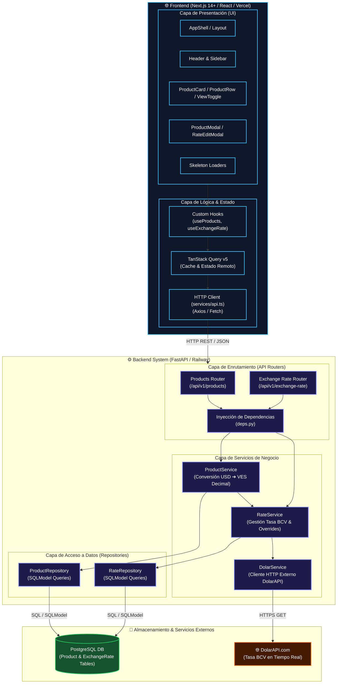

```mermaid
graph TB
    subgraph Client["🌐 Frontend (Next.js 14+ / React / Vercel)"]
        subgraph UI_Layer["Capa de Presentación (UI)"]
            AppShell["AppShell / Layout"]
            HeaderComp["Header & Sidebar"]
            ProductViews["ProductCard / ProductRow / ViewToggle"]
            Modals["ProductModal / RateEditModal"]
            Skeletons["Skeleton Loaders"]
        end

        subgraph Logic_Layer["Capa de Lógica & Estado"]
            Hooks["Custom Hooks<br/>(useProducts, useExchangeRate)"]
            ReactQuery["TanStack Query v5<br/>(Cache & Estado Remoto)"]
            APIClient["HTTP Client (services/api.ts)<br/>(Axios / Fetch)"]
        end
        
        UI_Layer --> Hooks
        Hooks --> ReactQuery
        ReactQuery --> APIClient
    end

    subgraph Backend_System["⚙️ Backend System (FastAPI / Railway)"]
        subgraph API_Routers["Capa de Enrutamiento (API Routers)"]
            ProductRouter["Products Router<br/>(/api/v1/products)"]
            RatesRouter["Exchange Rate Router<br/>(/api/v1/exchange-rate)"]
            Deps["Inyección de Dependencias<br/>(deps.py)"]
        end

        subgraph Service_Layer["Capa de Servicios de Negocio"]
            ProductService["ProductService<br/>(Conversión USD ➔ VES Decimal)"]
            RateService["RateService<br/>(Gestión Tasa BCV & Overrides)"]
            DolarService["DolarService<br/>(Cliente HTTP Externo DolarAPI)"]
        end

        subgraph Repository_Layer["Capa de Acceso a Datos (Repositories)"]
            ProductRepo["ProductRepository<br/>(SQLModel Queries)"]
            RateRepo["RateRepository<br/>(SQLModel Queries)"]
        end

        ProductRouter --> Deps
        RatesRouter --> Deps
        Deps --> ProductService
        Deps --> RateService
        ProductService --> ProductRepo
        ProductService --> RateService
        RateService --> RateRepo
        RateService --> DolarService
    end

    subgraph External_Data["💾 Almacenamiento & Servicios Externos"]
        PostgreSQL[("PostgreSQL DB<br/>(Product & ExchangeRate Tables)")]
        DolarAPI["🌐 DolarAPI.com<br/>(Tasa BCV en Tiempo Real)"]
    end

    %% Integraciones Cross-System
    APIClient -- "HTTP REST / JSON" --> API_Routers
    ProductRepo -- "SQL / SQLModel" --> PostgreSQL
    RateRepo -- "SQL / SQLModel" --> PostgreSQL
    DolarService -- "HTTPS GET" --> DolarAPI

    %% Estilos de Nodos
    classDef client fill:#0f172a,stroke:#38bdf8,stroke-width:2px,color:#fff;
    classDef backend fill:#1e1b4b,stroke:#818cf8,stroke-width:2px,color:#fff;
    classDef storage fill:#14532d,stroke:#22c55e,stroke-width:2px,color:#fff;
    classDef external fill:#451a03,stroke:#f97316,stroke-width:2px,color:#fff;

    class Client,UI_Layer,Logic_Layer,AppShell,HeaderComp,ProductViews,Modals,Skeletons,Hooks,ReactQuery,APIClient client;
    class ProductRouter,RatesRouter,Deps,ProductService,RateService,DolarService,ProductRepo,RateRepo backend;
    class PostgreSQL storage;
    class DolarAPI external;
```
