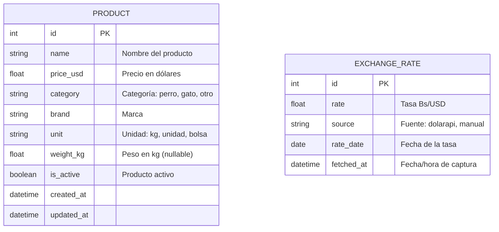

# 🐾 Pet-Price Venezuela — Plan de Implementación (MVP)

## Objetivo

Automatizar el cálculo de precios en Bolívares (Bs) para un negocio de comida de mascotas, usando la tasa oficial del BCV y exponiéndolo a través de una **interfaz web responsive** (desktop y móvil) con un asistente de IA integrado.

---

## Stack Tecnológico y Justificación

| Capa | Tecnología | ¿Por qué? |
|------|-----------|-----------| 
| **Backend** | Python 3.12+ / FastAPI | Framework asíncrono líder. Validación con Pydantic nativa. Altísima demanda global. |
| **ORM** | SQLModel + Alembic | Ver justificación detallada abajo ⬇️ |
| **Base de Datos** | PostgreSQL (Docker) | BD relacional open-source más demandada. Docker evita instalar nada en el sistema. |
| **Frontend** | Next.js 14+ (App Router) / TypeScript / Tailwind CSS v3 | Framework React #1. TypeScript es estándar en el mercado chileno/global. Tailwind acelera el diseño. |
| **Data Fetching** | TanStack Query (React Query) | Ver justificación detallada abajo ⬇️ |
| **IA** | LangChain + Google Gemini API | LangChain es el framework estándar para agentes IA. Gemini tiene capa gratuita generosa. |
| **Tasa USD/BCV** | DolarAPI.com (API REST pública) | API open-source gratuita que ya consume la tasa oficial del BCV. Cero scraping. |
| **Linter/Formatter** | Ruff | Ver justificación detallada abajo ⬇️ |
| **Gestor de paquetes Python** | uv | Reemplazo ultrarrápido de pip/pip-tools. Escrito en Rust. Herramienta trending 2024-2026. |
| **Deploy** | Railway (Backend + DB) / Vercel (Frontend) | PaaS modernos con free tier. Despliegue desde Git push. |

### ¿Por qué SQLModel?

> Es una librería creada por **Sebastián Ramírez**, el mismo autor de FastAPI. Combina dos mundos en un solo modelo:
> - **Pydantic** → validación de datos (lo que FastAPI usa para sus request/response).
> - **SQLAlchemy** → interacción con la base de datos (queries, relaciones, etc.).
>
> **Sin SQLModel** tendrías que definir el modelo de BD por un lado (SQLAlchemy) y el schema de respuesta por otro (Pydantic), duplicando código. **Con SQLModel** defines UNA sola clase que sirve para ambos. Es el ORM diseñado específicamente para trabajar con FastAPI.

### ¿Por qué TanStack Query (React Query)?

> En React, hacer `fetch()` dentro de un `useEffect` es el enfoque básico, pero en producción trae problemas: no hay cache, no hay reintentos automáticos, no hay indicadores de carga/error estandarizados, y hay race conditions.
>
> **TanStack Query** resuelve todo eso de una vez:
> - **Cache automático**: si el usuario navega y vuelve, los datos se muestran instantáneamente desde cache sin otra llamada HTTP.
> - **Refetch inteligente**: revalida la data en segundo plano (stale-while-revalidate).
> - **Estados listos**: cada query trae `isLoading`, `isError`, `data` — no necesitas manejar estados manualmente.
> - **Reintentos**: si la red falla, reintenta automáticamente.
>
> Es la librería estándar de data fetching en apps React profesionales a nivel global.

### ¿Qué es Ruff y para qué sirve?

> **Ruff** es un linter y formateador de código Python escrito en **Rust** (por eso es extraordinariamente rápido — hasta 100x más que las herramientas tradicionales). Reemplaza a la vez a:
> - `flake8` (detección de errores y malas prácticas)
> - `black` (formateo automático del código)
> - `isort` (ordenamiento de imports)
>
> **¿Para qué?** Garantiza que tu código Python siga convenciones profesionales de estilo consistente. En el mercado laboral, los proyectos serios siempre tienen un linter/formatter configurado. Ruff es la herramienta que está reemplazando a todas las anteriores por su velocidad y simplicidad. Se configura en una sola sección del `pyproject.toml`.

> [!TIP]
> **Aprendizaje clave:** Con este stack aprenderás: asincronismo real en Python, ORM moderno, TypeScript, App Router de Next.js, Function Calling / Tool Use de LLMs, consumo de APIs externas, y herramientas de productividad de nueva generación (Ruff, uv).

---

## Tasa del Dólar — DolarAPI.com

En vez de construir un scraper frágil contra el BCV directamente, usaremos la **API pública y open-source** [DolarAPI.com](https://dolarapi.com/docs/venezuela/), que ya se encarga de consumir y servir esos datos.

**Endpoint:** `GET https://ve.dolarapi.com/v1/dolares/oficial`

**Respuesta real (probada 2026-04-15):**
```json
{
  "moneda": "USD",
  "fuente": "oficial",
  "nombre": "Dólar",
  "compra": null,
  "venta": null,
  "promedio": 478.5811,
  "fechaActualizacion": "2026-04-15T00:00:00-04:00"
}
```

**Flujo en nuestro backend:**
1. FastAPI llama a `GET https://ve.dolarapi.com/v1/dolares/oficial` con `httpx`.
2. Extrae `promedio` (478.5811) y `fechaActualizacion`.
3. Almacena el resultado en la tabla `exchange_rates` para histórico y fallback.
4. Si la API externa falla → usa la última tasa guardada en nuestra BD.

> [!NOTE]
> En una fase futura se puede agregar un scraper directo al BCV como **Plan B** si DolarAPI dejara de funcionar.

---

## Estructura de Directorios (Explicada)

```
C:\proyectos\pet-price-venezuela\
│
├── backend/                          # ── BACKEND (Python/FastAPI) ──
│   │
│   ├── app/                          # Paquete principal de la aplicación
│   │   ├── __init__.py               # Marca este directorio como paquete Python
│   │   ├── main.py                   # Punto de entrada: crea la app FastAPI,
│   │   │                             #   registra routers y middleware (CORS, etc.)
│   │   │
│   │   ├── core/                     # Config transversal (no es lógica de negocio)
│   │   │   ├── config.py             # Lee variables de .env con pydantic-settings
│   │   │   │                         #   (DB_URL, API keys, etc.) — un solo lugar
│   │   │   └── database.py           # Crea el engine async y la sesión de SQLModel
│   │   │                             #   (conexión reutilizable a PostgreSQL)
│   │   │
│   │   ├── models/                   # Modelos de BD (tablas) — patrón estándar
│   │   │   ├── product.py            # Tabla "products": name, price_usd, category...
│   │   │   └── exchange_rate.py      # Tabla "exchange_rates": rate, date, source...
│   │   │
│   │   ├── schemas/                  # Schemas Pydantic de Request/Response
│   │   │   ├── product.py            # Ej: ProductResponse (incluye price_bs calculado)
│   │   │   └── chat.py               # Ej: ChatRequest, ChatResponse
│   │   │                             # ¿Por qué separar models/ de schemas/?
│   │   │                             # → models = estructura de la BD
│   │   │                             # → schemas = lo que la API recibe/devuelve
│   │   │                             #   (puede tener campos extra como price_bs)
│   │   │
│   │   ├── api/                      # Routers (endpoints agrupados por recurso)
│   │   │   ├── products.py           # GET /products, GET /products?search=...
│   │   │   ├── rates.py              # GET /rate, POST /update-rate
│   │   │   └── chat.py               # POST /chat (agente IA)
│   │   │                             # Patrón estándar FastAPI: cada archivo es un
│   │   │                             # APIRouter que main.py importa y registra.
│   │   │
│   │   └── services/                 # Lógica de negocio (NO endpoints, NO modelos)
│   │       ├── dolar_service.py      # Consume DolarAPI.com, guarda tasa en BD
│   │       ├── rate_service.py       # Obtiene tasa más reciente de BD
│   │       └── ai_agent.py           # Configura LangChain + Gemini + Tools
│   │
│   ├── alembic/                      # Migraciones de esquema de BD
│   │   ├── alembic.ini               # Config de Alembic (URL de BD, etc.)
│   │   ├── env.py                    # Script que Alembic ejecuta para migrar
│   │   └── versions/                 # Archivos de migración auto-generados
│   │                                 # ¿Por qué Alembic? → Permite cambiar tablas
│   │                                 # (agregar columnas, etc.) sin perder datos.
│   │
│   ├── scripts/
│   │   └── seed_data.py              # Script que carga el CSV inicial a la BD
│   │
│   ├── data/
│   │   └── products_sample.csv       # ~25 productos ficticios de mascotas
│   │
│   ├── pyproject.toml                # Dependencias + config de Ruff + metadatos
│   ├── .env.example                  # Plantilla de variables de entorno
│   └── Dockerfile                    # Para deploy en Railway
│
├── frontend/                         # ── FRONTEND (Next.js/React) ──
│   │ (se creará en Fase 2 del desarrollo)
│   └── ...
│
├── docker-compose.yml                # Levanta PostgreSQL con un solo comando
├── .gitignore
├── README.md
└── implementation_plan.md            # ← ESTE ARCHIVO
```

> [!NOTE]
> **¿Es estándar esta estructura?** Sí. Sigue el patrón recomendado oficialmente por FastAPI y es el que encontrarás en proyectos profesionales open-source. La separación `models/` vs `schemas/` vs `services/` vs `api/` es el estándar de la industria para mantener responsabilidades claras. Cada capa tiene una sola responsabilidad:
> - `api/` → recibe HTTP, valida, delega
> - `services/` → lógica de negocio pura
> - `models/` → estructura de persistencia
> - `schemas/` → contratos de la API
> - `core/` → configuración transversal

---

## Modelo de Base de Datos



> [!NOTE]
> El precio en Bs **NO se almacena** en la tabla `products`. Se calcula dinámicamente en cada consulta como `price_usd × tasa_más_reciente`. Esto garantiza que los precios siempre reflejen la tasa actual.

---

## Fases de Desarrollo

### Fase 1: Backend Completo (APIs funcionales) ← **EMPEZAMOS AQUÍ**

El objetivo de esta fase es tener **todas las APIs funcionando y probables** desde Swagger (`/docs`) antes de tocar el frontend.

#### 1.1 Infraestructura
- `docker-compose.yml` con PostgreSQL 16
- Entorno virtual Python con `uv`
- Dependencias: `fastapi`, `uvicorn`, `sqlmodel`, `alembic`, `asyncpg`, `httpx`, `pydantic-settings`, `ruff`
- Archivo `.env` con `DATABASE_URL` y `GEMINI_API_KEY`

#### 1.2 Modelos + Migraciones
- Modelos SQLModel para `Product` y `ExchangeRate`
- Alembic configurado y primera migración ejecutada

#### 1.3 Servicio de Tasa (DolarAPI)
- Servicio `dolar_service.py` que consume `https://ve.dolarapi.com/v1/dolares/oficial`
- Guarda la tasa en `exchange_rates` para histórico y fallback

#### 1.4 Endpoints API

| Método | Ruta | Descripción | Response |
|--------|------|-------------|----------|
| `GET` | `/api/v1/products` | Lista productos con precio calculado en Bs | `[{id, name, price_usd, price_bs, category, ...}]` |
| `GET` | `/api/v1/products?search=gatsy` | Filtrado por nombre | Mismo formato, filtrado |
| `GET` | `/api/v1/products?category=gato` | Filtrado por categoría | Mismo formato, filtrado |
| `GET` | `/api/v1/rate` | Tasa actual del BCV | `{rate, rate_date, source, fetched_at}` |
| `POST` | `/api/v1/update-rate` | Refresca tasa desde DolarAPI | `{rate, rate_date, message}` |

#### 1.5 Seed de datos
- CSV con ~25 productos ficticios
- Script `seed_data.py` para poblar la BD

#### 1.6 Validaciones
- Middleware global de excepciones JSON
- CORS configurado
- Si no hay tasa → HTTP 503

**✅ Criterio de éxito Fase 1:** Todos los endpoints responden correctamente en Swagger `/docs`, con datos reales de la BD y tasa actual de DolarAPI.

---

### Fase 2: Frontend (Next.js) — *Feature futura*

- Inicializar Next.js con TypeScript + Tailwind CSS + App Router
- Vista catálogo responsive (web + móvil)
- Cabecera sticky con tasa del dólar
- Buscador con debounce
- TanStack Query para data fetching

---

### Fase 3: Agente de IA — *Feature futura*

- Endpoint `POST /api/v1/chat`
- LangChain + Gemini con Tool Calling
- Herramientas: `buscar_producto`, `obtener_tasa`, `calcular_precio`
- Widget de chat en el frontend

---

## Decisiones de Diseño

| Decisión | Elección | Justificación |
|----------|----------|---------------|
| Tasa USD | DolarAPI.com (API pública) | API open-source estable. Elimina complejidad de scraping. |
| LLM Provider | Google Gemini (gratuito) | Capa gratuita generosa, excelente para MVP |
| Datos semilla | CSV ficticio generado | ~25 productos simulados de marcas reales |
| Directorio raíz | `C:\proyectos\pet-price-venezuela` | Workspace del usuario |
| Cálculo de precio Bs | Dinámico (no almacenado) | Siempre actualizado sin batch jobs |
| Gestor de paquetes | uv | Aprendizaje de herramienta trending |
| Enfoque de desarrollo | Backend-first | APIs 100% funcionales antes de tocar frontend |

---

## Plan de Verificación (Fase 1)

### Tests Automatizados
- Tests con `pytest` + `httpx` (TestClient de FastAPI) para cada endpoint.
- Test del servicio DolarAPI con respuesta mockeada.

### Verificación Manual
- Levantar PostgreSQL con `docker compose up -d`.
- Ejecutar el servidor con `uvicorn`.
- Probar todos los endpoints en Swagger UI (`http://localhost:8000/docs`).
- Verificar que `GET /products` devuelve precios calculados correctamente en Bs.
- Verificar que `POST /update-rate` refresca la tasa desde DolarAPI.

---

> [!IMPORTANT]
> **Próximo paso:** Una vez que apruebes este plan, comienzo creando toda la **Fase 1** — estructura de archivos, Docker, modelos, servicio de tasa (DolarAPI), endpoints y seed de datos. Todo el backend funcional.
