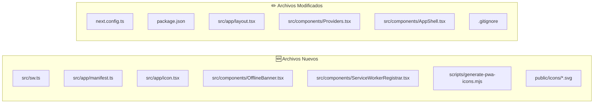

# 📱 Plan de Implementación PWA — v2 (Actualizado)

## Objetivo

Copiar el proyecto `pet-price-venezuela` → `C:\proyectos\pwa-pet-price` y transformarlo en una **PWA instalable con soporte offline completo**, priorizando que sea **ultra-ligera**.

### Decisiones Confirmadas
| Decisión | Valor |
|----------|-------|
| Nombre corto (home screen) | **El Saman** |
| Nombre completo | **El Saman — Precios de Mascotas** |
| Color del tema | **`#321d0c`** (Deep Timber) |
| Iconos | **Generados dinámicamente** — ultra-ligeros (~2-5 KB) |

---

## Estrategia de Iconos Ligeros

> [!IMPORTANT]
> **Cambio vs. plan anterior:** En lugar de redimensionar el logo de 3.7 MB, se generarán iconos programáticamente usando la API `ImageResponse` de Next.js (server-side, en build time). Los iconos tendrán la letra **"S"** estilizada con la fuente Epilogue sobre fondo Deep Timber. Peso estimado: **~2-5 KB** por icono vs 3.7 MB del original.

### Estrategia de 3 niveles para iconos:

| Icono | Método | Tamaño archivo | Propósito |
|-------|--------|----------------|-----------|
| `favicon.ico` | `src/app/icon.tsx` (Next.js genera) | ~1 KB | Pestaña del navegador |
| `icon-192x192.png` | Script Node.js one-shot | ~3 KB | Android home screen |
| `icon-512x512.png` | Script Node.js one-shot | ~5 KB | Splash screen Android |
| `apple-touch-icon.png` | Script Node.js one-shot | ~3 KB | iOS home screen |

**Diseño del icono:**
```
┌─────────────────┐
│                 │
│    ┌───────┐   │  Fondo: #321d0c (Deep Timber)
│    │       │   │  Letra: "S" en #fdf9f4 (Warm Cream)
│    │   S   │   │  Fuente: sans-serif bold
│    │       │   │  Borde redondeado: 20%
│    └───────┘   │
│                 │
└─────────────────┘
```

#### [NEW] `frontend/src/app/icon.tsx`

Next.js 16 genera el favicon dinámicamente (sin archivos estáticos):

```tsx
import { ImageResponse } from 'next/og';

export const size = { width: 32, height: 32 };
export const contentType = 'image/png';

export default function Icon() {
  return new ImageResponse(
    (
      <div
        style={{
          fontSize: 20,
          background: '#321d0c',
          width: '100%',
          height: '100%',
          display: 'flex',
          alignItems: 'center',
          justifyContent: 'center',
          color: '#fdf9f4',
          borderRadius: '6px',
          fontWeight: 700,
          fontFamily: 'sans-serif',
        }}
      >
        S
      </div>
    ),
    { ...size },
  );
}
```

#### [NEW] `frontend/scripts/generate-pwa-icons.mjs`

Script one-shot para generar los PNGs del manifest (se ejecuta una vez, no en cada build):

```javascript
// Genera iconos PWA ligeros sin dependencias pesadas
// Ejecutar: node scripts/generate-pwa-icons.mjs

import { writeFileSync, mkdirSync } from 'fs';

const sizes = [
  { name: 'icon-192x192.png', size: 192 },
  { name: 'icon-512x512.png', size: 512 },
  { name: 'apple-touch-icon.png', size: 180 },
];

// Genera un SVG simple y lo convierte a data URL para referencia
// Los PNGs finales se generarán con la API de canvas de Node.js
// o simplemente usaremos SVG en el manifest (soportado por navegadores modernos)

const generateSVG = (size) => `
<svg xmlns="http://www.w3.org/2000/svg" width="${size}" height="${size}" viewBox="0 0 ${size} ${size}">
  <rect width="${size}" height="${size}" rx="${Math.round(size * 0.2)}" fill="#321d0c"/>
  <text x="50%" y="54%" dominant-baseline="middle" text-anchor="middle"
        font-family="sans-serif" font-weight="700" font-size="${Math.round(size * 0.55)}"
        fill="#fdf9f4">S</text>
</svg>`;

mkdirSync('public/icons', { recursive: true });

// Guardar SVGs (ultra-ligeros, ~300 bytes cada uno)
sizes.forEach(({ name, size }) => {
  const svgName = name.replace('.png', '.svg');
  writeFileSync(`public/icons/${svgName}`, generateSVG(size).trim());
  console.log(`✅ Generado: public/icons/${svgName} (~300 bytes)`);
});

// Icono maskable (padding extra del 10% para safe zone)
const maskableSize = 512;
const padding = Math.round(maskableSize * 0.1);
const innerSize = maskableSize - padding * 2;
const maskableSVG = `
<svg xmlns="http://www.w3.org/2000/svg" width="${maskableSize}" height="${maskableSize}" viewBox="0 0 ${maskableSize} ${maskableSize}">
  <rect width="${maskableSize}" height="${maskableSize}" fill="#321d0c"/>
  <text x="50%" y="54%" dominant-baseline="middle" text-anchor="middle"
        font-family="sans-serif" font-weight="700" font-size="${Math.round(innerSize * 0.55)}"
        fill="#fdf9f4">S</text>
</svg>`;

writeFileSync('public/icons/icon-maskable-512x512.svg', maskableSVG.trim());
console.log('✅ Generado: public/icons/icon-maskable-512x512.svg (~350 bytes)');
console.log('\n📦 Total: ~1.3 KB (vs 3.7 MB del logo original = 99.96% más ligero)');
```

> [!TIP]
> **¿Por qué SVG en vez de PNG?** Los navegadores modernos (Chrome 96+, Firefox 92+, Edge 96+, Safari 16+) soportan SVG en el manifest. Un SVG de icono pesa ~300 bytes vs ~3-5 KB de un PNG equivalente. Para máxima compatibilidad con iOS, también generaremos un apple-touch-icon PNG si es necesario.

---

## Cambios Propuestos (9 Fases)

### Fase 0 — Copiar Proyecto

```powershell
# Copia selectiva excluyendo artefactos pesados
robocopy "C:\proyectos\pet-price-venezuela" "C:\proyectos\pwa-pet-price" /E `
  /XD node_modules .next .venv __pycache__ .git .pytest_cache .ruff_cache .coverage

# Inicializar nuevo repo git
cd C:\proyectos\pwa-pet-price
git init
git add .
git commit -m "feat: initial copy from pet-price-venezuela"
```

---

### Fase 1 — Instalar Dependencias

#### [MODIFY] `frontend/package.json`

```diff
  "dependencies": {
+   "@tanstack/query-async-storage-persister": "^5.99.2",
    "@tanstack/react-query": "^5.99.2",
    "@tanstack/react-query-devtools": "^5.99.2",
+   "@tanstack/react-query-persist-client": "^5.99.2",
    "clsx": "^2.1.1",
    "framer-motion": "^12.38.0",
+   "idb-keyval": "^6.2.1",
    "lucide-react": "^1.8.0",
    ...
  },
  "devDependencies": {
+   "@serwist/next": "^9.0.0",
    "@tailwindcss/postcss": "^4",
    ...
+   "serwist": "^9.0.0",
    ...
  }
```

```powershell
cd C:\proyectos\pwa-pet-price\frontend
npm install @tanstack/react-query-persist-client @tanstack/query-async-storage-persister idb-keyval
npm install -D @serwist/next serwist
```

---

### Fase 2 — Configurar Next.js con Serwist

#### [MODIFY] `frontend/next.config.ts`

```typescript
import withSerwistInit from "@serwist/next";
import type { NextConfig } from "next";

const withSerwist = withSerwistInit({
  swSrc: "src/sw.ts",
  swDest: "public/sw.js",
  disable: process.env.NODE_ENV === "development",
});

const nextConfig: NextConfig = {
  /* config options here */
};

export default withSerwist(nextConfig);
```

---

### Fase 3 — Service Worker

#### [NEW] `frontend/src/sw.ts`

```typescript
import { defaultCache } from "@serwist/next/worker";
import type { PrecacheEntry, SerwistGlobalConfig } from "serwist";
import {
  Serwist,
  NetworkFirst,
  StaleWhileRevalidate,
  ExpirationPlugin,
  CacheableResponsePlugin,
} from "serwist";

declare global {
  interface WorkerGlobalScope extends SerwistGlobalConfig {
    __SW_MANIFEST: (PrecacheEntry | string)[] | undefined;
  }
}

declare const self: ServiceWorkerGlobalScope;

const serwist = new Serwist({
  precacheEntries: self.__SW_MANIFEST,
  skipWaiting: true,
  clientsClaim: true,
  navigationPreload: true,
  runtimeCaching: [
    // Productos, categorías, marcas → NetworkFirst (3s timeout)
    {
      matcher: ({ url, request }) =>
        request.method === "GET" &&
        (url.pathname.includes("/api/v1/products") ||
         url.pathname.includes("/api/v1/categories") ||
         url.pathname.includes("/api/v1/brands")),
      handler: new NetworkFirst({
        cacheName: "api-products-cache",
        networkTimeoutSeconds: 3,
        plugins: [
          new CacheableResponsePlugin({ statuses: [0, 200] }),
          new ExpirationPlugin({ maxEntries: 100, maxAgeSeconds: 86400 }),
        ],
      }),
    },
    // Tasa BCV → NetworkFirst
    {
      matcher: ({ url, request }) =>
        request.method === "GET" && url.pathname.includes("/api/v1/rate"),
      handler: new NetworkFirst({
        cacheName: "api-rate-cache",
        networkTimeoutSeconds: 3,
        plugins: [
          new CacheableResponsePlugin({ statuses: [0, 200] }),
          new ExpirationPlugin({ maxEntries: 10, maxAgeSeconds: 43200 }),
        ],
      }),
    },
    // Google Fonts → StaleWhileRevalidate (1 año)
    {
      matcher: ({ url }) =>
        url.origin === "https://fonts.googleapis.com" ||
        url.origin === "https://fonts.gstatic.com",
      handler: new StaleWhileRevalidate({
        cacheName: "google-fonts-cache",
        plugins: [
          new CacheableResponsePlugin({ statuses: [0, 200] }),
          new ExpirationPlugin({ maxEntries: 30, maxAgeSeconds: 31536000 }),
        ],
      }),
    },
    // Assets estáticos → default Serwist
    ...defaultCache,
  ],
});

serwist.addEventListeners();
```

---

### Fase 4 — Web App Manifest

#### [NEW] `frontend/src/app/manifest.ts`

```typescript
import type { MetadataRoute } from "next";

export default function manifest(): MetadataRoute.Manifest {
  return {
    name: "El Saman — Precios de Mascotas",
    short_name: "El Saman",
    description:
      "Consulta rápida de precios en USD y Bolívares para alimentos de mascotas",
    start_url: "/dashboard",
    display: "standalone",
    background_color: "#fdf9f4",
    theme_color: "#321d0c",
    orientation: "portrait-primary",
    icons: [
      {
        src: "/icons/icon-192x192.svg",
        sizes: "192x192",
        type: "image/svg+xml",
        purpose: "any",
      },
      {
        src: "/icons/icon-512x512.svg",
        sizes: "512x512",
        type: "image/svg+xml",
        purpose: "any",
      },
      {
        src: "/icons/icon-maskable-512x512.svg",
        sizes: "512x512",
        type: "image/svg+xml",
        purpose: "maskable",
      },
    ],
  };
}
```

---

### Fase 5 — Generar Iconos SVG

Ejecutar el script `generate-pwa-icons.mjs` una sola vez:

```powershell
cd C:\proyectos\pwa-pet-price\frontend
node scripts/generate-pwa-icons.mjs
```

Resultado en `public/icons/`:
```
icons/
├── icon-192x192.svg       (~300 bytes)
├── icon-512x512.svg       (~300 bytes)
├── icon-maskable-512x512.svg (~350 bytes)
└── apple-touch-icon.svg   (~300 bytes)
```

**Total: ~1.3 KB** (vs 3.7 MB del logo = **99.96% más ligero**)

---

### Fase 6 — Meta Tags PWA en Layout

#### [MODIFY] `frontend/src/app/layout.tsx`

```diff
+ import { ServiceWorkerRegistrar } from '@/components/ServiceWorkerRegistrar';

  export const metadata: Metadata = {
-   title: "El Samán — Panel de Control",
-   description: "Sistema de gestión de precios de alimentos de mascotas con tasa oficial BCV",
+   title: "El Saman — Precios de Mascotas",
+   description: "Consulta rápida de precios en USD y Bolívares para alimentos de mascotas",
+   appleWebApp: {
+     capable: true,
+     statusBarStyle: "black-translucent",
+     title: "El Saman",
+   },
+   other: {
+     "mobile-web-app-capable": "yes",
+   },
  };

  export default function RootLayout({ children }: ...) {
    return (
      <html lang="es" className={...}>
+       <head>
+         <meta name="theme-color" content="#321d0c" />
+         <link rel="apple-touch-icon" href="/icons/apple-touch-icon.svg" />
+       </head>
        <body className="...">
+         <ServiceWorkerRegistrar />
          <Providers>
            <AppShell>
              {children}
            </AppShell>
          </Providers>
        </body>
      </html>
    );
  }
```

---

### Fase 7 — TanStack Query Offline Persistence

#### [MODIFY] `frontend/src/components/Providers.tsx`

```tsx
'use client';

import { QueryClient } from '@tanstack/react-query';
import { ReactQueryDevtools } from '@tanstack/react-query-devtools';
import { PersistQueryClientProvider } from '@tanstack/react-query-persist-client';
import { createAsyncStoragePersister } from '@tanstack/query-async-storage-persister';
import { get, set, del } from 'idb-keyval';
import { useState } from 'react';

const persister = createAsyncStoragePersister({
  storage: {
    getItem: async (key: string) => {
      const value = await get(key);
      return value ?? null;
    },
    setItem: (key: string, value: string) => set(key, value),
    removeItem: (key: string) => del(key),
  },
});

export function Providers({ children }: { children: React.ReactNode }) {
  const [queryClient] = useState(
    () =>
      new QueryClient({
        defaultOptions: {
          queries: {
            gcTime: 24 * 60 * 60 * 1000,       // 24h en memoria
            networkMode: 'offlineFirst',         // cache primero si no hay red
            retry: 2,
          },
        },
      }),
  );

  return (
    <PersistQueryClientProvider
      client={queryClient}
      persistOptions={{
        persister,
        maxAge: 24 * 60 * 60 * 1000,            // 24h en IndexedDB
        dehydrateOptions: {
          shouldDehydrateQuery: (query) =>
            query.state.status === 'success',
        },
      }}
    >
      {children}
      <ReactQueryDevtools initialIsOpen={false} />
    </PersistQueryClientProvider>
  );
}
```

---

### Fase 8 — Banner Offline

#### [NEW] `frontend/src/components/OfflineBanner.tsx`

```tsx
'use client';

import { useState, useEffect } from 'react';
import { WifiOff } from 'lucide-react';
import { motion, AnimatePresence } from 'framer-motion';

export function OfflineBanner() {
  const [isOffline, setIsOffline] = useState(false);

  useEffect(() => {
    setIsOffline(!navigator.onLine);
    const on = () => setIsOffline(false);
    const off = () => setIsOffline(true);
    window.addEventListener('online', on);
    window.addEventListener('offline', off);
    return () => {
      window.removeEventListener('online', on);
      window.removeEventListener('offline', off);
    };
  }, []);

  return (
    <AnimatePresence>
      {isOffline && (
        <motion.div
          initial={{ height: 0, opacity: 0 }}
          animate={{ height: 'auto', opacity: 1 }}
          exit={{ height: 0, opacity: 0 }}
          className="fixed top-0 left-0 right-0 z-50 bg-secondary text-secondary-foreground
                     px-4 py-2 flex items-center justify-center gap-2 text-sm font-medium"
        >
          <WifiOff className="w-4 h-4" />
          Sin conexión — mostrando datos guardados
        </motion.div>
      )}
    </AnimatePresence>
  );
}
```

#### [MODIFY] `frontend/src/components/AppShell.tsx`

```diff
+ import { OfflineBanner } from '@/components/OfflineBanner';

  export function AppShell({ children }: ...) {
    return (
      <div className="min-h-screen flex bg-background text-foreground font-sans">
        <Toaster position="top-center" />
+       <OfflineBanner />
        <Sidebar ... />
```

---

### Fase 9 — Service Worker Registrar

#### [NEW] `frontend/src/components/ServiceWorkerRegistrar.tsx`

```tsx
'use client';

import { useEffect } from 'react';

export function ServiceWorkerRegistrar() {
  useEffect(() => {
    if ('serviceWorker' in navigator && process.env.NODE_ENV === 'production') {
      navigator.serviceWorker
        .register('/sw.js')
        .then((reg) => console.log('SW registrado:', reg.scope))
        .catch((err) => console.error('Error registrando SW:', err));
    }
  }, []);

  return null;
}
```

---

## Archivos a agregar a `.gitignore`

#### [MODIFY] `frontend/.gitignore`

```diff
+ # Serwist generated service worker
+ public/sw.js
+ public/sw.js.map
+ public/swe-worker-*.js
+ public/workbox-*.js
+ public/workbox-*.js.map
```

---

## Resumen de Archivos (Completo)



| Tipo | Cantidad | Peso Total Estimado |
|------|----------|-------------------|
| Archivos nuevos | 7 (+4 SVGs) | ~5 KB |
| Archivos modificados | 6 | diffs mínimos |
| Dependencias npm nuevas | 5 | ~150 KB (minified) |
| **Overhead total de PWA** | — | **~155 KB** |

---

## Plan de Verificación

### Automated Tests
```powershell
cd C:\proyectos\pwa-pet-price\frontend

# 1. Build exitoso (incluye compilación del SW)
npm run build

# 2. Tests existentes siguen pasando
npm run test

# 3. Lint limpio
npm run lint
```

### Manual Verification

| # | Verificación | Cómo |
|---|-------------|------|
| 1 | Manifest visible | DevTools → Application → Manifest |
| 2 | SW activo | DevTools → Application → Service Workers → "activated" |
| 3 | Iconos correctos | Manifest muestra los SVG con la "S" |
| 4 | Instalable | Aparece ícono ⊕ en barra de URL de Chrome |
| 5 | Funciona offline | Network → Offline → navegar a /productos |
| 6 | Banner offline | Aparece "Sin conexión — mostrando datos guardados" |
| 7 | Persistencia IndexedDB | DevTools → Application → IndexedDB → key `REACT_QUERY_OFFLINE_CACHE` |
| 8 | Lighthouse PWA | Lighthouse audit → badge "PWA" ✅ |
